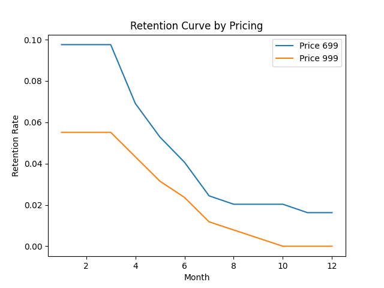
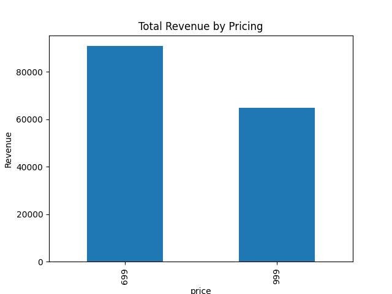

# Decision Framework for Pricing Strategy (D2C Subscription)

## Problem This Solves

D2C founders often debate pricing from intuition: lower price for growth, higher price for premium positioning. The actual problem is knowing which price point improves conversion, retention, LTV, CAC payback, and revenue at the same time.

## How It Helps

- Simulates subscription behavior across two price points and compares conversion, retention, revenue, LTV, ARPU, and CAC payback.
- Turns a pricing debate into a forkable decision framework with charts and a clear recommendation.
- Gives founders a starting model for validating price cuts, tiering, and pricing A/B tests before changing production pricing.

## When To Fork This

- Fork this if you run a D2C, subscription, fitness, wellness, creator, or consumer SaaS business and need a pricing decision model.
- Fork it when your team is debating growth pricing vs premium positioning without cohort-level evidence.
- Replace the synthetic assumptions with your own funnel, retention, CAC, ARPU, and cohort data.

## Use This In Your Company

- Use it as a pricing decision model for D2C, subscription, wellness, creator, or consumer SaaS products.
- Keep the comparison logic: price point -> conversion -> retention -> LTV -> revenue -> CAC payback.
- Replace synthetic assumptions with your funnel, cohort, price, and retention data.

## Minimum Edits To Make It Yours

- price points
- conversion assumptions
- retention/churn assumptions
- CAC and revenue inputs

The fastest path is: fork the repo, replace the inputs above, run the demo or open the template, then adjust only the parts that reflect your company's workflow.

## Executive Summary (1-Slide)

- Decision: Reduce pricing from ₹999 → ₹699
- Why:
  - Conversion increases materially at lower price
  - Retention improves slightly, indicating better product-market fit at this price point
  - LTV increases despite lower ARPU due to higher retention
  - Total revenue is maximized at ₹699
- Impact:
  - Faster user acquisition
  - Stronger top-line growth
  - Improved unit economics (LTV > CAC, faster payback)
- Risks:
  - Potential brand dilution (premium perception)
  - Attracting lower-intent users
- Mitigation:
  - Introduce tiered pricing (Basic vs Premium)
  - Run controlled A/B experiments before full rollout
  - Monitor cohort retention and LTV closely

---

## Key Results Snapshot

- Conversion Rate:
  - ₹699: ~9.1%
  - ₹999: ~4.4%

- LTV:
  - ₹699: ~₹362
  - ₹999: ~₹260

- Revenue:
  - ₹699 outperforms ₹999 by ~40%+

Conclusion: Lower pricing improves both growth and unit economics.

---

## Business Context

The company is a D2C fitness subscription platform offering personalized workout and diet plans. The current pricing is ₹999/month.

However, the business is facing:
- Low conversion from free to paid users  
- High early-stage churn  
- Increasing competition from lower-priced alternatives  

This raises the need to evaluate whether pricing is a key constraint to growth.

---

## Objective

To determine whether reducing subscription pricing improves customer lifetime value (LTV), conversion rates, and overall revenue without compromising unit economics.

---

## Core Question

Should the company reduce its subscription pricing to improve growth and retention?

---

## Approach

The problem was broken down into:

- Conversion impact  
- Retention behavior  
- Revenue generation  
- Customer lifetime value (LTV)  
- Unit economics (ARPU, CAC payback)  

A simulated dataset was created to model user behavior across different pricing strategies.

---

## Dataset

Synthetic dataset generated using Python to simulate subscription behavior.

**Key Columns:**
- user_id  
- month  
- price  
- converted  
- churned  
- retained  
- acquisition_channel  

---

## Key Insights

1. Conversion improves significantly at lower pricing  
   Lower price reduces entry friction and increases paid user volume  

2. Retention is higher for lower-priced users  
   Users show slightly better stickiness at ₹699  

3. LTV increases despite lower pricing  
   Higher retention offsets the lower price point  

4. Revenue is maximized at ₹699  
   Increased volume drives higher total revenue  

---

## Trade-Off Analysis

| Factor | ₹699 | ₹999 |
|--------|------|------|
| Conversion | High | Low |
| Retention | Moderate | Lower |
| LTV | Higher | Lower |
| Revenue | Higher | Lower |
| Positioning | Mass | Premium |

---

## Visual Analysis

### Retention Curve
Shows user retention trends over time across pricing strategies.



### LTV Comparison
Compares customer lifetime value across pricing strategies.


### Revenue Comparison
Highlights total revenue impact by pricing strategy.



---

## Business Impact

- Pricing optimization can increase revenue by ~40%+
- Improved conversion reduces CAC payback period
- Higher retention compounds long-term LTV growth

---

## Recommendation

The company should reduce pricing from ₹999 to ₹699.

This pricing strategy:
- Maximizes revenue  
- Improves customer acquisition  
- Enhances retention  
- Strengthens overall unit economics  

---

## Strategic Considerations

- Introduce tiered pricing to retain premium positioning  
- Run A/B tests before full rollout  
- Monitor retention cohorts closely  
- Evaluate long-term LTV impact over a longer horizon  

---

## What I Would Do Next as Founder’s Office

1. Run Controlled Pricing Experiment
   - A/B test ₹999 vs ₹699 across cohorts
   - Measure conversion, 30-day retention, and LTV

2. Introduce Tiered Pricing
   - ₹499: Entry-level (limited features)
   - ₹699: Core plan (optimized for growth)
   - ₹999: Premium plan (advanced features, coaching, personalization)

3. Improve Onboarding Experience
   - Reduce early churn by improving first-session experience
   - Add guided onboarding and habit formation nudges

4. Cohort-Based Retention Analysis
   - Track retention by acquisition channel and pricing
   - Identify high-LTV segments

5. Optimize CAC Channels
   - Double down on high-performing channels (organic/referral)
   - Reduce spend on low-LTV cohorts

6. Build LTV Forecasting Model
   - Project long-term revenue under different pricing scenarios
   - Support future pricing and growth decisions

---

## Conclusion

Pricing is a critical growth lever.

A reduction to ₹699 improves both growth and unit economics, making it the optimal strategy for scaling the business.

---

## Tech Stack

- Python (Pandas, NumPy)  
- Matplotlib  
- Synthetic Data Simulation  

---

## Project Structure

```
d2c-pricing-strategy-decision-framework/
│
├── data/
│   ├── generate_dataset.py
│   └── subscription_data.csv
│
├── analysis/
│   └── unit_economics.py
│
├── visuals/
│   └── plots.py
├── retention_curve.png
├── ltv_comparison.png
├── revenue_comparison.png
├── pricing_strategy_summary.csv
│
└── README.md
```

## How to Run

1. Generate dataset:

```bash
python3 data/generate_dataset.py
```

2. Run analysis:

```bash
python3 analysis/unit_economics.py
```

3. Generate visuals:

```bash
python3 visuals/plots.py
```
